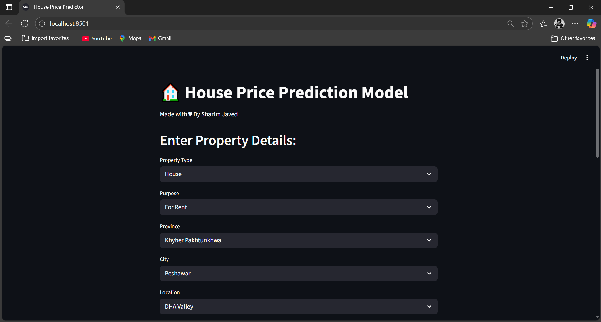

🏠 House Price Prediction App

View live at:https://house-price-predictor-shazim.streamlit.app

A Streamlit web application that predicts house prices using a Random Forest Regressor model. The app takes user inputs for various features of a house and returns the estimated price instantly.

📸 DEMO

📌 Features

Built with Streamlit for an interactive web interface.

Random Forest Regressor algorithm for high accuracy predictions.

R² Score: 0.98 (98% accuracy).

User-friendly design with real-time predictions.

Handles multiple input features such as:

Number of bedrooms

Bathrooms

Square footage

Location

And more...

🛠 Tech Stack

Python

Streamlit

Scikit-learn

Pandas, NumPy

📂 Project Structure
📦 house-price-prediction
├── main.ipynb           
├── price_model.pkl
├── app.py          
├── requirements.txt 
├──zameen.csv   
└── README.md            

🚀 How to Run Locally

Clone this repository:

git clone https://github.com/<your-username>/House-price-predictor.git
cd House-price-predictor

Install dependencies:

pip install -r requirements.txt

Run the Streamlit app:

streamlit run app.py

✅ Model Performance

Algorithm: Random Forest Regressor

R² Score: 98%

Evaluation Metrics: Mean Squared Error, Mean Absolute Error

🤝 Contributing

Contributions, issues, and feature requests are welcome!
Feel free to fork and submit pull requests.

📬 Contact

Feel free to connect for queries or collaboration:
📧 Email: shazimjaved448@gmail.com
